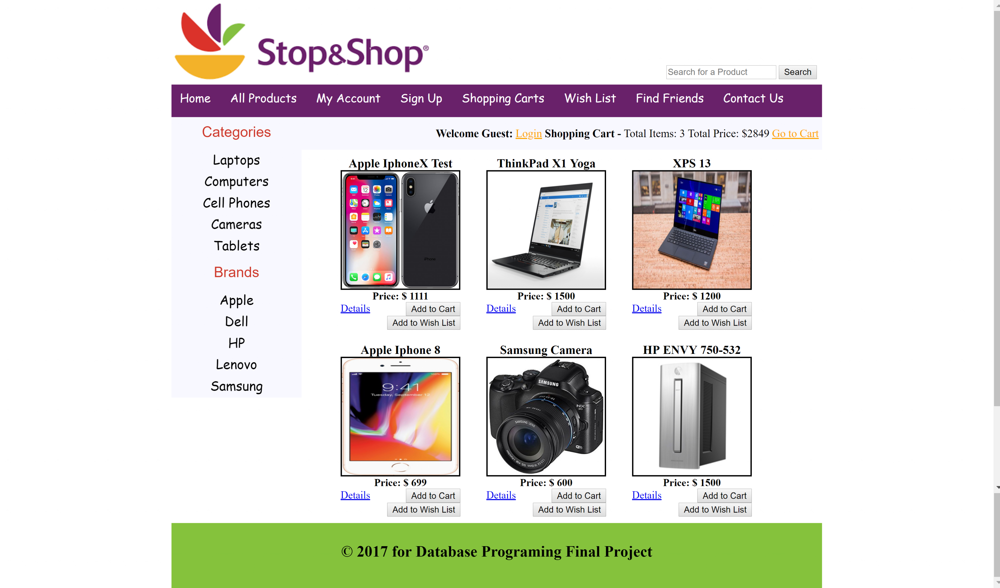
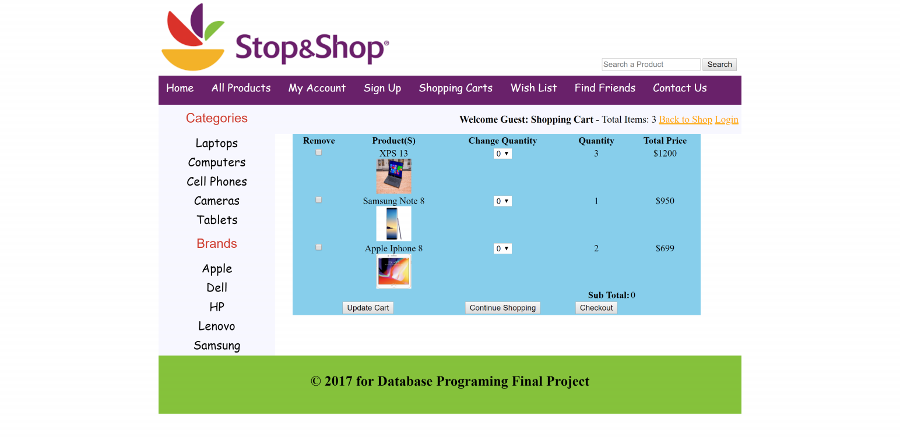
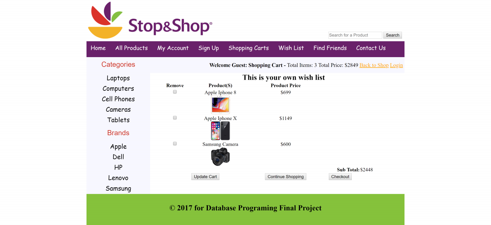
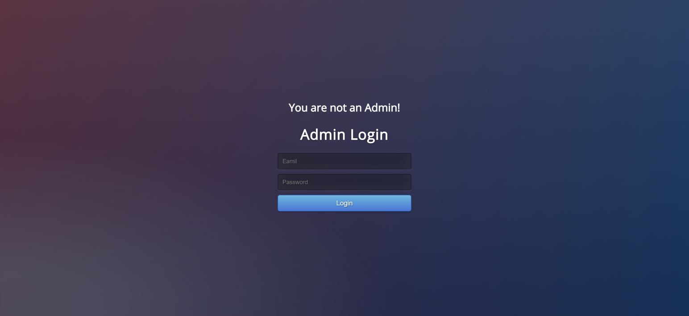
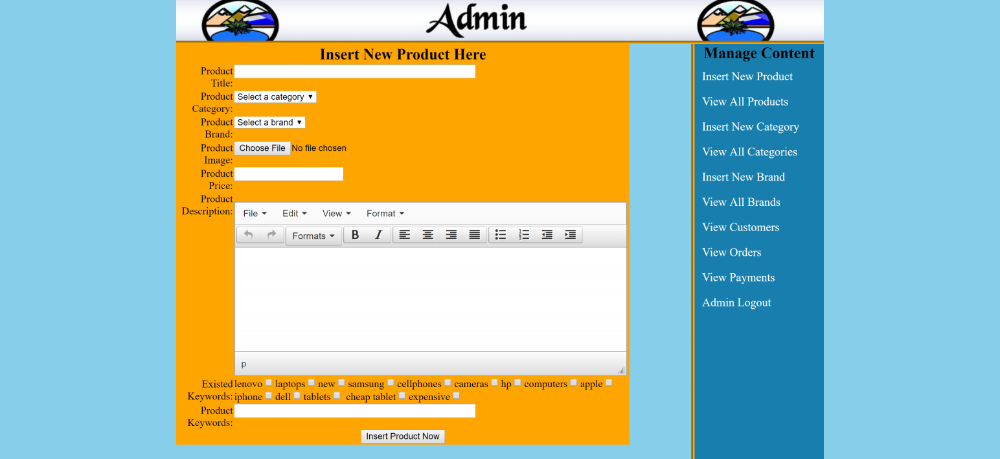
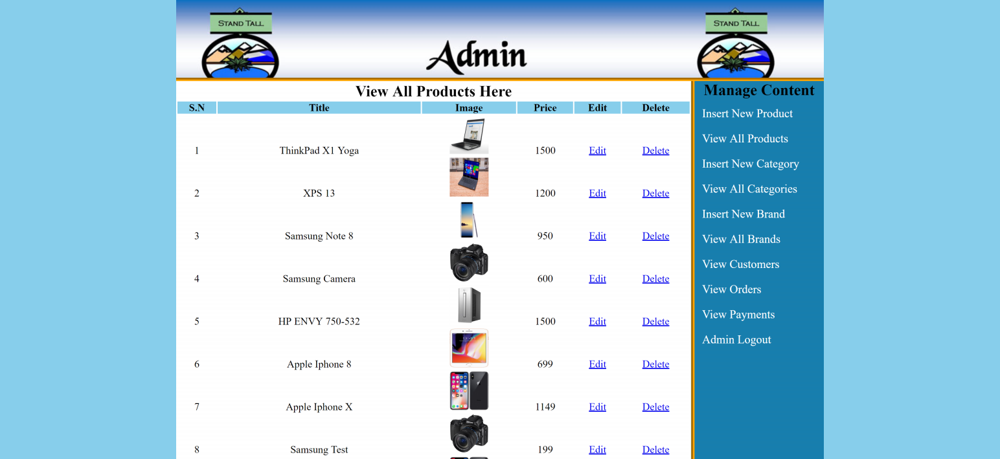
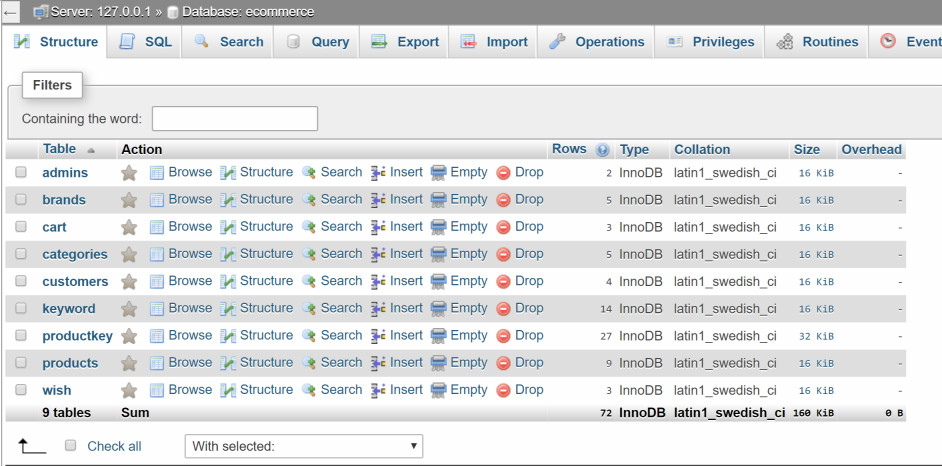

# ecommerceFinalProject
Final Project for Database Programming class Fall 2017
- Programming Language: PHP
- Tools used: PHPMyAdmin, MySQL, tinymce.js (used for textarea of insert_product page)

#Project description:
Stop&Shop: an E-commerce website
-
The homepage looks like:

- The shopping cart page looks like:

- Additional feature, wishList, so user can add things they wish to 
have and visible to other people.

- In this project, I also created a custom backend for admins, so they can make 
modifications on products saved in database. The URL for accessing to admin back
end is: http://localhost/ecommerce/admin_area/
- And the login page looks like:

- The insert new product page looks like:

- To make modifications on existing products, admin can click view
all products and make modifications on price and etc.

# database
Please use the ecommerce.sql attached, you need to create a database ecommerce and then import tables using XAMPP phpmyadmin
- The tables created for this project is as following:
